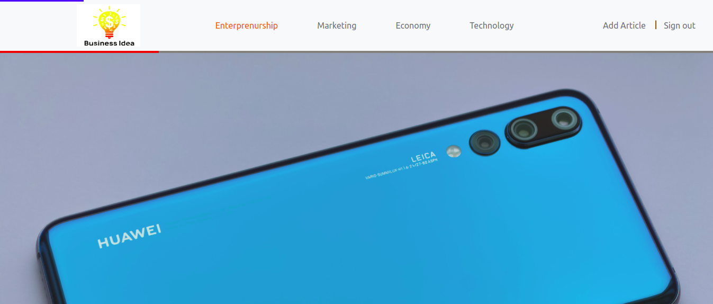
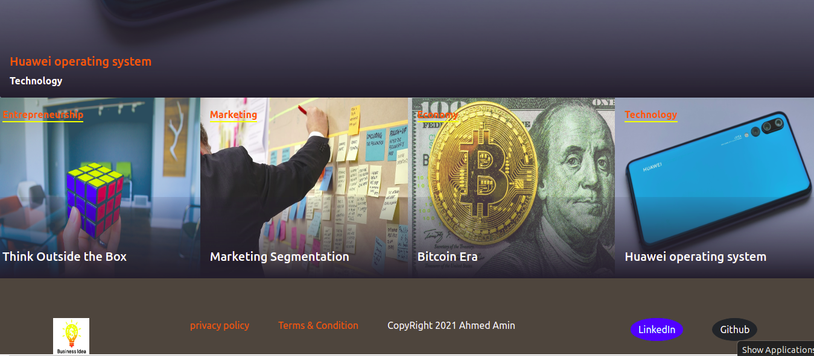
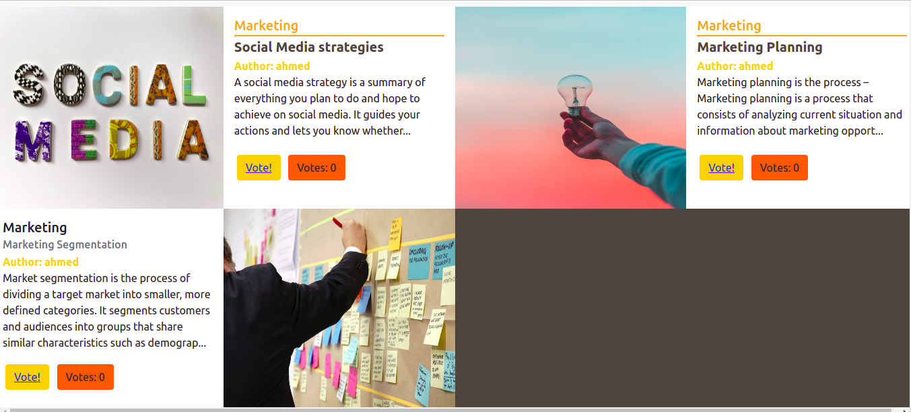

#  BUSINESS ARTICLES !
 
> In this project, I created a web application using Ruby on Rails for writing business articles dividing into four categories (Enterprenurship, Marketing, Economy and Technology).
# In this application:
- You can create a new user.
- Users can create and vote articles and edit and delete only their articles.
- The header and footer are fixed for all pages.
- The home page contains two sections, the main section which has the article with large number of votes:



and the second one four boxes each box represent one category and contain the details of most recent article in this category.



- The category archive page contain all articles cards under this category, and this card contains:
1. Title
2. Author name
3. 150 letters from the article.
4. Vote button.
5. Votes counter.
6. Feature image of this article.





# Live preview :

[Live Link](https://gentle-taiga-48607.herokuapp.com/)


## Presntation Video:

[Presentation Link](https://www.loom.com/share/59b96d70737441db83810f1dfd60da12)


## Built With
- Ruby (v. 2.7.2).
- Ruby on Rails (v. 6.1.1).
- Rubocop.
- Rsepc.
- Capybara.
- Bootstrap.
- Devise.
- Cloudinary and Active storage.
- Deployed to Heroku.
 
## Setup

1. To run this project locally, please ensure you have Ruby and Ruby on Rails installed on your machine.
2. Open the terminal.
3. Clone this repository by running:

```bash
git clone https://github.com/AhmedAmin90/Business-Articles
```

4. Install gems: Enter to the folder of the project in your local machine and After that write in the terminal: 

```bash
bundle install
```
Note: "It is preferable to install gems with 2.1.4 bundle version"

5. Setup database with:

```
   rails db:create
   rails db:migrate
```

6. Setup seed file to intiate Categories:

```
   rails db:seed
```

7. Open the local server:

```bash
bin/rails server
```

# Notes:
- I followed the design pattern according:https://www.behance.net/gallery/14554909/liFEsTlye-Mobile-version
  Thanks to: Nelson Sakwa  for this creative design.
- The design is Not responsive , so I created the styles according my screen size and it will be appear in the presentation video. So may be some changes in the style may be present on different screen sizes.
- Thanks to My stand up team member: Miguel Ricaño @mricanho for his outstanding help in Heroku issues.


## Authors

**Ahmed Amin** 
- GitHub: [@AhmedAmin90](https://github.com/AhmedAmin90)
- LinkedIn: [Ahmed Amin](https://www.linkedin.com/in/web-developer/)


## Contribute
Any advice and suggestion for improvement are more than welcome.
Visit [issues' section](https://github.com/AhmedAmin90/Business-Articles/issues)

## Show your support
Give a star if you like this project!

## License
<p>This project is <a href="./LICENSE">MIT</a> licensed.</p>


